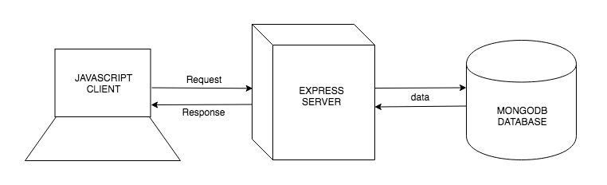
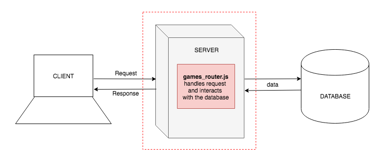

# Mongo With a Server

**Lesson Duration: 120 minutes**

### Learning Objectives
- Understand the relationship between a client, server and database
- Be able to connect to a MongoDB database from a server
- Be able to create a JSON API using MongoDB and Express

## Introduction

By creating a RESTful API we are able to create a back-end service for our front-end applications to consume. Following API design principles to implement the CRUD operations, we can ensure that the API is intuitive to use. We have seen how to create a RESTful API using an Express server.

We have also seen how to use a MongoDB database to persist and retrieve non-relational data, using its shell to find and insert JSON documents into collections.

In this lesson we are going to create a RESTful JSON API for a games resource, using an Express server and a MongoDB database. We are going to define a set of routes that implement CRUD functionality and the data being served on the end-points will be retrieved by the server from the database.

## Games Hub Application

> Instructor note: Hand out start code.

This is how the full stack JavaScript application, Games Hub, is structured.



*Games Hub: A full stack JavaScript application*

### Task: (10 minutes)

Run the start code using the instructions in the README.md. From reading any errors that appear in the browser console and from looking at the codebase, identify which functionality of the application hasn't been written yet.

<details>
<summary>Answer</summary>

The server-side application does not implement the routes that the front-end application is making requests to. Also, the server does not connect to a database.

</details>

In this lesson we are going to be working server-side to:
- connect to the `games_hub` database.
- access the `games` collection.
- create the routes for the games resource inserting and retrieving data from the database. We will be using Insomnia REST Client to test each route as we write it.



*We will be working server-side to create the API that the front-end consumes*

## MongoDB Driver

Until now we have been interacting with our MongoDB databases using the MongoDB shell, running a file with the command, `mongo < file_name.js`. In order to interact with databases from inside our JavaScript applications, we are going to use the MongoDB Driver API. The MongoDB Drive is an npm package, so let's start by installing it.

```bash
npm i mongodb
```

## Connecting to the Database

Our server is configured to delegate the routing to the index router and we want the routing for the games resource to be handled by the games router. Inside index router we are going to connect to the `games_hub` database, access the `games` collection, and pass an object representing the games collection to the games router, so that the games router can interact with the games collection in each of its routes.

Let's start by requiring the MongoDB Driver that we previously installed in index_router.js, and accessing the MongoClient object.

```js
// index_router.js

const express = require('express');
const router = express.Router();
const MongoClient = require('mongodb').MongoClient; // NEW
```

We will use MongoClient's `connect` method, that will provide us with a client object that we can use to connect to the `games_hub` database. `connect` takes two arguments:

1. A URL - The URL must consist of MongoDB's proprietary access mechanism (rather than HTTP which you will have more commonly seen), the location and the port number. MongoDB server runs on port 27017 by default.
2. A callback - Creating the connection is asynchronous, so once the process is complete, it will invoke the callback, passing it an error if the connection was unsuccessful and a client object if it was successful.

```js
const MongoClient = require('mongodb').MongoClient;

MongoClient.connect('mongodb://localhost:27017', (err, client) => { // NEW

});
```

We will use the client object to connect to the `games_hub` database using the `db` method passing in the name of the database, and then we can access the `games` collection from the database using the `collection` method passing in the name of the collection.

```js
MongoClient.connect('mongodb://localhost:27017', (err, client) => {
  const db = client.db('games_hub'); // NEW
  const gamesCollection = db.collection('games'); // NEW
});
```

We want to delegate the routing for the games resource to the games router. To do this we call the `use` method which takes a path and a router. The path will be '/api/games' and we are going to create a games router passing it `gamesCollection` because (although we haven't written it yet) we know that the games router will need access the games collection in its route definitions.

```js
MongoClient.connect('mongodb://localhost:27017', (err, client) => {
  const db = client.db('games_hub');
  const gamesCollection = db.collection('games');
  router.use('/api/games', gamesRouter(gamesCollection)); // NEW
});
```

## Games Router

Until now our routers have all:

1. created a router object
2. defined a set of routes on the router object
3. exported the router object

Our games router is going to be slightly different. We need it to pass it reference to the games collection, so that has access to the collection in each route definition. Therefore our games router will be a function that takes in the collection and returns a router object.

We still need to start by creating the Router object.

```js
// games_router.js

const express = require('express');
const router = express.Router();
```

Next we will declare and export a function, `gamesRouter`, that takes in the collection and returns the router object.

```js
const express = require('express');
const router = express.Router();

const gamesRouter = function (gamesCollection) { // NEW

  return router; // NEW
};

module.exports = gamesRouter; // NEW
```

Now we can define each of the routes within the function, and `gamesCollection` will always be available to us.

### Index Route

Let's start with the index route. As before we will use the `get` method on the router, pass it a path and a callback that gets passed the request and response objects.

```js
// games_router.js
const gamesRouter = function (gamesCollection) {

  router.get('/', (req, res) => { // NEW

  });

  return router;
};
```

When there is a request made to this route, we want the all the documents to be retrieved from the games collection in the database and sent back, as JSON, with the response. We have access to the games collection (`gamesCollection`), so we can call the `find` method on it to get all the documents back.

```js
router.get('/', (req, res) => {
  gamesCollection.find() //NEW
});
```

The `find` method returns a cursor object containing the documents. We want an array of documents, so we can convert the cursor into an array, using the `toArray` method.

```js
router.get('/', (req, res) => {
  gamesCollection.find().toArray() // MODIFIED
});
```

Lastly, because the `toArray` method is asynchronous, it returns a promise. This means we can chain a `then` passing it a callback. When the promise resolves and the array of documents is ready, `then` will pass the array of documents to the callback (`docs`). We serialise the array into JSON and send it back on the response.

```js
router.get('/', (req, res) => {
  gamesCollection.find().toArray()
    .then((docs) => res.json(docs))
});
```

Now you can test the index route in Insomnia REST Client, by creating a new GET request, and making the request to http://localhost:3000/api/games. You will see the JSON response of the game objects you initially seeded your database with.

Because we are chaining a number of methods in this route, we can format it to make it more readable.

```js
router.get('/', (req, res) => {
  gamesCollection // MODIFIED
    .find()
    .toArray()
    .then((docs) => res.json(docs))
});
```

Now we can see more easily that we are:

1. calling `find` on the collection to get back a cursor object of all the documents
2. converting the cursor into an array with `toArray`
3. and `then` once that process has completed, we are sending the array of documents (`docs`), as JSON, back with the response.

We have now completed the index route, and you can test it using Insomnia Rest Client with a GET request to http://localhost:3000/api/games.

### Show Route

The show route, by convention, returns one game object. It will be use the get method and the route path will need a parameter in the URL (for example, `:id`), so that the client can specify which game they want to receive when they make a request.

```js
const gamesRouter = function (gamesCollection) {

  // ...

  router.get('/:id', (req, res) => { // NEW

  });

  return router;

};
```

We are going to use the ID that the client specifies in the request to find the corresponding game object from the database. Let's access the ID of the request's params object, using our parameter name.

```js
router.get('/:id', (req, res) => { // NEW
  const id = req.params.id;
});
```

Now we have the ID, we can use MongoDB's `findOne` method, which takes a query object. If we were to search by name, we would do the following, `findOne({name: 'Love Letter'})`, but we can't be sure every game has a unique name.

#### MongoDB's ObjectID

When inserting a document into the database, MongoDB assigns it unique identifier with the key `_id`. To query the database for an object with a particular ID, we want to do the following, `findOne({_id: '5af2d6f93776ded87a62a4ec'})`. However, the ID will never match if the ID is passed as a string because MongoDB stores ID's as `ObjectIds`](https://docs.mongodb.com/manual/reference/method/ObjectId/). Therefore to find a document, we have to pass the ID as an ObjectID. ObjectID comes from MongoDB so we need to require it.

```js
const express = require('express');
const router = express.Router();
const ObjectID = require('mongodb').ObjectID; // NEW
```

Now when we want to query the database for a particular ID, we can pass the `findOne` method the object `{ _id: ObjectID(5af2d6f93776ded87a62a4ec) }`.

```js
router.get('/:id', (req, res) => { // NEW
  const id = req.params.id;
  gamesCollection
    .findOne({ _id: ObjectID(id) })
});
```

Lastly, we want to send the found game object back, as JSON, with the response. As `findOne` is asynchronous (it takes time) and returns a promise, we will use `then` to receive the found game once the promise has been resolved. We can then convert the document to JSON and send it back with the response.

```js
router.get('/:id', (req, res) => { // NEW
  const id = req.params.id;
  gamesCollection
    .findOne({ _id: ObjectID(id) })
    .then((docs) => res.json(docs));
});
```

We have now completed the show route, and you can test it using Insomnia Rest Client with a GET request to http://localhost:3000/api/games/[existing ID].

### Create Route

### Task: (10 minutes)

Your task is to create the show route.

You will need to:
- check that the server is configured to use body-parser
- define a new route that handles POST requests
- access the `game` object from the request's body. By looking at the client's `GameFormView` (client/src/views/game_form_view.js), we can see the data will be sent as an object with the key, `game`.
- insert the game into the games collection using the `insertOne` method
- send back all the documents from the collection with the response. Note: `insertOne` is asynchronous and returns a promise, so use a `then` to receive all the games from the collection once the promise has resolved, convert the documents into to an array, convert the array into JSON and send it back with the response.

Test the create route in Insomnia REST Client, by creating a new POST request and adding the following JSON object to the body:

```js
{
	"game": {
		"name": "Chess",
		"playingTime": 60,
		"players": {
			"min": 2,
			"max": 2
		}
	}
}
```

Make the request to http://localhost:3000/api/games/ and you will see the JSON response of the all the game objects including the one you added.

<details>
<summary>Example solution</summary>

server.js contains the configuration to use body-parser, so we can go ahead and define a POST route that has access to the body object:

```js
router.post('/', (req, res) => {
  const newGame = req.body.game;
  gamesCollection
    .insertOne(newGame)
    .then(() => {
      gamesCollection
        .find()
        .toArray()
        .then((docs) => res.json(docs));
    });
});
```

</details>

We have now completed the create route.

### Destroy Route

### Task: (10 minutes)

Your task is to create the destroy route.

You will need to:

- define a new route that handles DELETE requests with an id parameter in the path
- access the ID from the request's `params` object
- use `deleteOne` to delete the document in the games collection that has an ID that matches the ID specified in the request. To do this, pass `deleteOne` an object with the key of the property you want to search by, and the value you want to search with: `{ _id: ObjectID(id) }`
- send back all the documents from the collection with the response. Note: `deleteOne` is asynchronous and returns a promise, so use `then` to find all the games from the collection, convert the documents into to an array, convert the array into JSON and send it back with the response.

<details>
<summary>Example solution</summary>

```js
router.delete('/:id', (req, res) => {
  const id = req.params.id;
  gamesCollection
    .deleteOne({ _id: ObjectID(id) })
    .then(() => {
      gamesCollection
        .find()
        .toArray()
        .then((docs) => res.json(docs));
    });
});

```
</details>

We have now completed the destroy route, and you can test it using Insomnia Rest Client with a DELETE request to http://localhost:3000/api/games/[existing ID].

### Update Route

Let's now write the update route. We will use the `put` method, and pass it a path with an `id` parameter, and the callback that will get passed the request and response.

```js
router.put('/:id', (req, res) => {

});
```

To update a document in the database we need find the correct document from the database, and update it with the new values from the request. Let's start by getting the ID of the object we want to update from the request's `params` object, an the new game object with the updated values from the request's `body` object.

```js
router.put('/:id', (req, res) => {
  const id = req.params.id;
  const updatedGame = req.body.game;
});
```

Now we are going to use those two piece of information to update the document in the database's collection, using the collection's `updateOne` method. `updateOne` takes two arguments, both objects:

1. The first is used to query the collection to find the document that matches the filter (in our case we are searching by ID)
2. The second is an object that has the property `$set`. This is telling MongoDB to set each of the fields of the found document, with the values of the corresponding properties of `updatedGame`.

```js
router.put('/:id', (req, res) => {
  const id = req.params.id;
  const updatedGame = req.body.game;
  gamesCollection
    .updateOne(
      { _id: ObjectID(id) },
      { $set: updatedGame }
    )
});
```

Once that is complete we want to send all the documents back with the request, including the updated one. `updateOne` is asynchronous and returns a promise, so we will use `then` to find all the games from the collection, convert the documents into to an array, convert the array into JSON and send it back with the response.

```js
router.put('/:id', (req, res) => {
  const id = req.params.id;
  const updatedGame = req.body.game;
  gamesCollection
    .updateOne(
      { _id: ObjectID(id) },
      { $set: updatedGame }
    )
    .then(() => {
      gamesCollection
      .find()
      .toArray()
      .then((docs) => res.json(docs));
    });
});
```

Test the update route in Insomnia REST Client, by creating a new PUT request and add an updated JSON game object into the body. Make the request to http://localhost:3000/api/games/[existing ID] and you will see the JSON response of the all the game objects including the one you updated.

We have now completed the update route.

We have now created a RESTful JSON API for our games resource, with data being persisted in a MongoDB database. We have tested all of the routes in Insomnia Rest Client to ensure they work and because the client application has already be implemented to consume these routes, if you visit http://localhost:3000/ you should have a fully functional application.

## Recap

Why do we need to use MongoDB Driver API?

<details>
<summary>Answer</summary>

So that we can interact with the MongoDB database from inside our JavaScript applications.

</details>

Why do we need to use promises in the games resource routes?

<details>
<summary>Answer</summary>

Because interacting with the database is asynchronous, so we need to wait until the process is complete before continuing to execute our code. For example, retreving one games object from the database using `findOne` takes time, so until the process has complete, we don't have the object to send back with the response.

</details>

## Conclusion

To create a RESTful JSON API we used an Express server to define a set of routes, and the MongoDB Driver to interacted with the data stored in a MongoDB database. We complete the back-end of a full stack JavaScript application.
