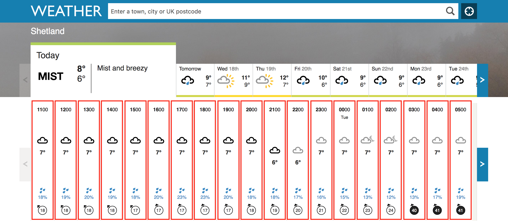

# Pub/Sub with Nested Reusable Views

**Lesson Duration: 60 minutes**

### Learning Objectives
- Know how to render nested views using the Pub/Sub pattern
- Know how to implement a reusable view
- Understand the benefits of nested and reusable views

## Intro

Until now we have been using the Pub/Sub pattern with custom events to create applications that have modular front-end code. The Pub/Sub pattern has enabled us to design our programs to be extensible and maintainable, adhering to the single responsibility principle and keeping a clear separation of concerns.

As our applications grow in size and the information being is displayed on the page becomes more complex, we want to ensure that our applications continue to be well-structured and easy to reason about. One way that we can do this is to use nested and reusable views.  

### Reusable Views

By making our views generic we make them reusable. We can then populate the same view with different information, enabling us to use it multiple times in the same application, which makes our code DRY, or to use it in again in different applications.

Let's look at an exmaple on the [BBC Weather website] (https://www.bbc.co.uk/weather)


*An example of a reused view, where each hour's weather information makes use of the same view*

A view is created to display one hour's weather data, and that view is then reused, each time populated with relevant information.

### Nested Views

Implementing nested views is a way of organising our views in a tree-like structure. A nested view is a view that is rendered by another view.

For example, if we look at [BBC Weather's homepage](https://www.bbc.co.uk/weather), there might be a Header view that is responsible for rendering a Logo view, a NavBar view and a SearchBar view. The Logo, NavBar and SearchBar view would be nested inside the Header view.


*Example structure of nested views in the BBC weather website*


*Nested views where the Header view is responsible for rendering the other views*

If each section of our application follow this pattern, as the complexity of the page display increases, the views will continue to be easy to reason about.

> Instructor note: Give out code

### Paired Discussion Task: (40 minutes)

Your task is to investigate the provided codebase to understand the application architecture. Thinking about the design decisions that have been made and why, will help us understand how we might structure our more complex applications in the future.

Run the _Languages of the World_ application:

```bash
npm run build
```
Open index.html in the browser and select a continent from the menu.

### Application Data

- The `Continents` model makes an `XMLHttpRequest` to an API. Make the same request in the browser to see what data the model is receiving. To do this you can copy-paste the URL into the address bar of your browser and view the JSON.

### Application Architecture

- Looking at the codebase, draw a diagram to visualise the Pub/Sub event and data flow through the app.

### Application Views

- Using the browser Inspect pane in the devtools to view the DOM, draw out the structure of the web page. Use the ids and classes as the labels.

- Looking at the codebase, draw a tree-diagram to show the view rendering responsibility hierarchy.

Answer the following questions:

2. Which views are rendered more than once?
3. Which views are nested in which other views?
4. What are the benefits of reusing views in this way?

